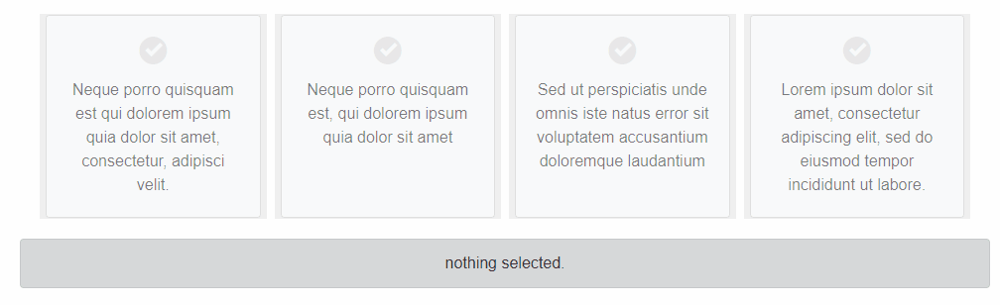

# BlazingMahi Mcombo


Blazor combo selection component that displays selection options in a grid type layout.



Live Example: https://blazingmahi.github.io/Mcombo/

## Getting Started

You can install the package via the NuGet package manager just search for BlazingMahi. You can also install via powershell using the following command.

```powershell
Install-Package BlazingMahi.Mcombo
```
### Add Imports
Add the following to your _Imports.razor or to your razor page files.
```csharp
@using BlazingMahi.Mcombo
```
### Add Style reference
```html
<link href="_content/BlazingMahi.Mcombo/styles.css" rel="stylesheet" />
```

### Add Mcombo Component
Mcombo is configured using parameters on the `<Mcombo></Mcombo>` component. The following options are available.

- Value (selected value)
- Moptions (List of selection items. )
- Columns (Bootstrap columns for display. Default: 3)
- SelectedColor (Bootstrap color of selected item. Default: primary )
- TextClass (style class override for text.)


#### Example: display 4 combo items. 

```html


<Mcombo @bind-Value="@SelectedItem" Moptions="moptions"></Mcombo>

<div class="alert alert-dark text-center">
    @SelectedItem
</div>


@code{

    public string SelectedItem = "nothing selected.";

    List<Mcombo.Moption> moptions = new List<Mcombo.Moption>() 
    {
        new Mcombo.Moption {
            Value = "Option 1",
            Text = "Neque porro quisquam est qui dolorem ipsum quia dolor sit amet, consectetur, adipisci velit."
        },
        new Mcombo.Moption {
            Value = "Option 2",
            Text = "Neque porro quisquam est, qui dolorem ipsum quia dolor sit amet"
        },
        new Mcombo.Moption
        {
            Value = "Option 3",
            Text = "Sed ut perspiciatis unde omnis iste natus error sit voluptatem accusantium doloremque laudantium"
        },
        new Mcombo.Moption
        {
            Value = "Option 4",
            Text = "Lorem ipsum dolor sit amet, consectetur adipiscing elit, sed do eiusmod tempor incididunt ut labore."
        }
    };

}

```
  Result would be...
  


